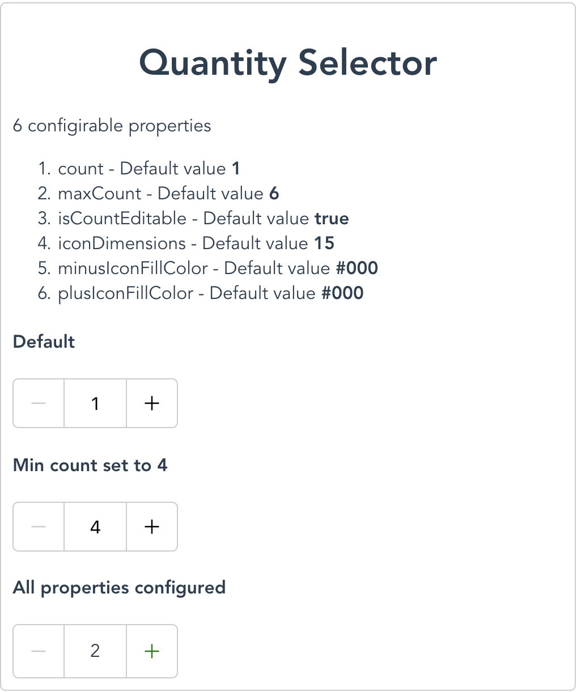
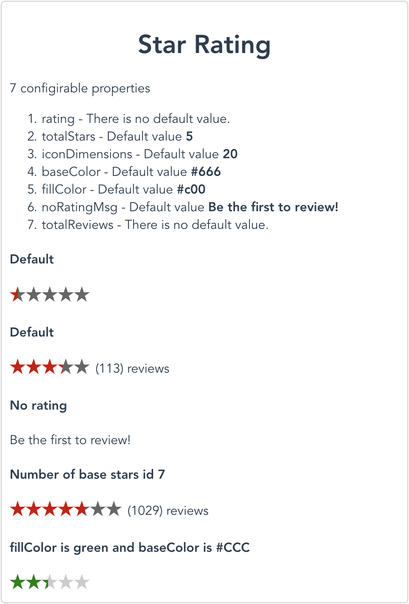
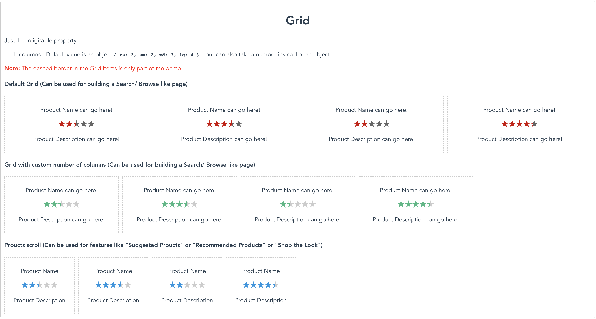
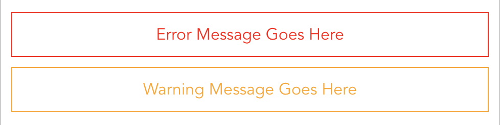
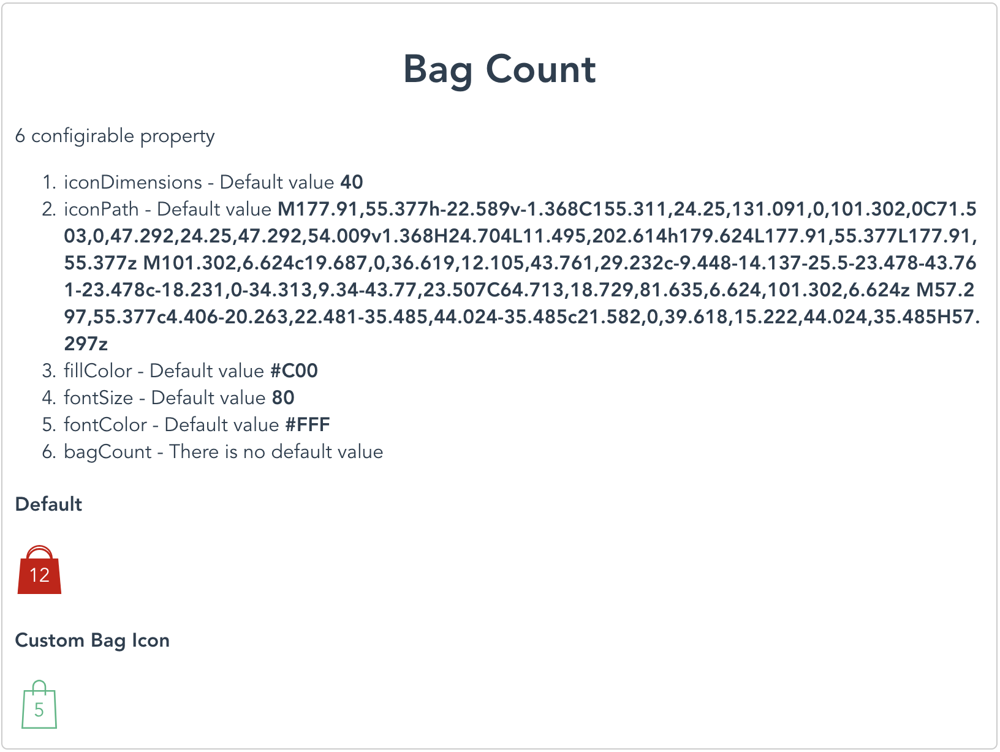
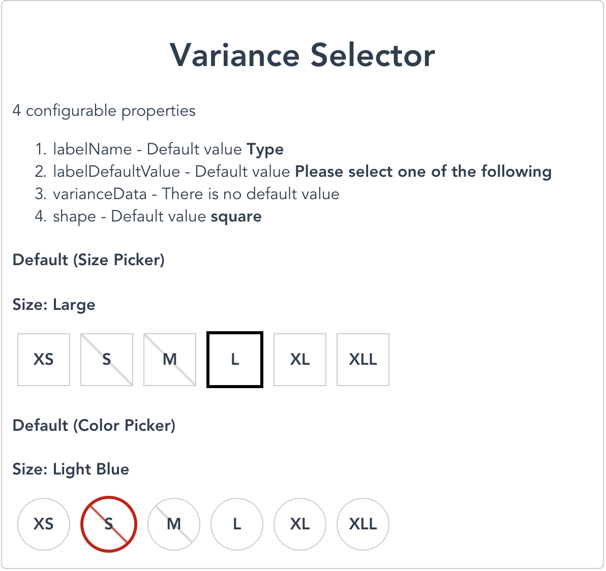

# Vue based UI Nuggets for e-commerce sites

## Site - https://ecommerce-vue-nuggets.herokuapp.com/

## What is this? ❓❓❓

I am creating a library of UI components targeted towards e-commerce sites..✌️

## Why am I doing this? 🤔

I was doing a comparative study of various e-commerce sites; large and small and I realized 💭 that a lot of things are common to these sites. These things are something that can be componentized 🗃️ and used across sites. ℹ️

These comonents are currently being built using [Vue](https://vuejs.org/). I might consider building the same components using [React](https://reactjs.org/) as well. At some point I might even consider creating [Web Components](https://www.webcomponents.org/) for this.

## Unit Tests 💉

I will try and keep the test coverage for all of these components at a 100% at all times. 😃 Currently it is very low. 😢 (I promise this will improve)

## Browser Support

**Chrome**, **Firefox** and **Safari** are 100% supported! Not everything will ne supported on IE11 and Edge!

## Accessibility

Web Accessibility is extrememly important! I will make all the efforts to implement and test the components for web accessibility.

### List of components 📇

## 1. Quantity Selector (Dev Complete) 🍰



#### Usage

```javascript
<QuantitySelector />
```

#### Properties

| Property Name      | Default Value | Required |  Type   |
| ------------------ | :-----------: | :------: | :-----: |
| count              |       1       |    No    | Number  |
| maxCount           |       6       |    No    | Number  |
| isCountEditable    |     true      |    No    | Boolean |
| iconDimensions     |      15       |    No    | Number  |
| minusIconFillColor |     #000      |    No    | String  |
| plusIconFillColor  |     #000      |    No    | String  |

Count of the component is emitted to the parent copmponent using a custom event `get-count`

## 2. Star Rating (WIP) 🏗️



#### Usage

```javascript
<StarRating :rating="3.5" />
```

#### Properties

| Property Name  |      Default Value      | Required |      Type      |
| -------------- | :---------------------: | :------: | :------------: |
| totalStars     |            5            |    No    |     Number     |
| rating         |           NA            |   Yes    |     Number     |
| noRatingMsg    | Be the first to review! |    No    |     String     |
| totalReviews   |           NA            |    No    | Number/ String |
| fillColor      |          #C00           |    No    |     String     |
| baseColor      |          #666           |    No    |     String     |
| iconDimensions |           20            |    No    |     Number     |

## 3. Responsive Product Grid (Dev Complete) 🍰



I initially started off building a Grid based on what made most sense at that time; defining the number of cells and the number of columns based on the breakpoints. Ans hence the component was this way.

#### Usage

```javascript
<Grid :cells="10" />

<Grid :cells="10" :columns="5" />

<Grid :cells="17" :columns="{xs: 2, sm: 3, md: 4, lg: 5}" />
```

I soon realized that this is not what developers would want out of the Grid component. Use cases like a Product Grid (Search/ Browse page), "Suggested Products" or "Similar Products" like scroll, Product Page and so on are all truely data driven. So there is the CSS grid and then the **data** that is the most critical part!

So I have updated the implementation and the usage is no longer going to look like it appears above!

#### Usage

```javascript
/* Use the following when you want to build a product scroll like feature */
<Grid :columns="7">
    <GridItem v-for="(item, index) in dataGrid" :key="index">
        <p>Content in each cell goes here!</p>
    </GridItem>
</Grid>

/* Use the following when you want to build a search/ browse page like feature */
<Grid :columns="{xs: 2, sm: 3, md: 4, lg: 5}">
    <GridItem v-for="(item, index) in dataGrid" :key="index">
        <p>Content in each cell goes here!</p>
    </GridItem>
</Grid>
```

#### Notes

1. I am making use of 4 CSS break-points, prescribed by [Twitter Bootstrap](https://getbootstrap.com/docs/4.1/layout/overview/).
2. ```css
   /* Extra small devices (portrait phones, less than 576px) */
   @media all and (max-width: 575.98px) {
   	...;
   }

   /* Small devices (landscape phones, less than 768px) */
   @media all and (max-width: 767.98px) {
   	...;
   }

   /* Medium devices (tablets, less than 992px) */
   @media (max-width: 991.98px) {
   	...;
   }

   /* Large devices (desktops, less than 1200px) */
   @media (min-width: 992px) {
   	...;
   }

   /* Extra large devices (large desktops)
   No media query since the extra-large breakpoint has no upper bound on its width */
   ```

3. The columns prop can accept a number or an object in the following format
    ```javascript
    {
        xs: 2,
        sm: 3,
        md: 4,
        lg: 5
    }
    ```
4. The keys **xs**, **sm**, **md** and **lg** correspond to the 4 break points described above.
5. The values for each of these keys is the number of columns that you would like to display for that break point.
6. The dashed border on each cell is just representative. Actual component does not have this border.
7. The number displayed inside of the cell is also represtative. Actual component does not have this number.

#### Properties

| Property Name |        Default Value         | Required |       Type       |
| ------------- | :--------------------------: | :------: | :--------------: |
| columns       | {xs: 2, sm: 2, md: 3, lg: 4} |    No    | Number or Object |

## 4. Alerts (errors and warnings) Global/page-level and inline (Dev Complete) 🍰




#### Usage

```javascript
<GlobalAlert />
```

#### Properties

| Property Name | Default Value | Required |  Type   |
| ------------- | :-----------: | :------: | :-----: |
| alertType     |     error     |    No    | String  |
| alertPosition |    global     |    No    | String  |
| isActive      |     false     |    No    | Boolean |
| persistFor    |      NA       |    No    | Number  |

#### Notes

1. Persistance of the global alert signifies the time for which the alert will be shown and then it will disappear! The time is expected in seconds! The component will convert it to milli-seconds.
2. In case there is a global error and an inline field level error on the screen, the global error message will always take presidence. Meaning, the screen will scroll to the global error message first.

## 5. Bag Count (Dev Complete) 🍰



### Usage

```javascript
<BagCount />
```

#### Properties

| Property Name  |                                                                                                                                                                                                                   Default Value                                                                                                                                                                                                                    | Required |  Type  |
| -------------- | :------------------------------------------------------------------------------------------------------------------------------------------------------------------------------------------------------------------------------------------------------------------------------------------------------------------------------------------------------------------------------------------------------------------------------------------------: | :------: | :----: |
| iconDimensions |                                                                                                                                                                                                                         20                                                                                                                                                                                                                         |    No    | Number |
| iconPath       | M177.91,55.377h-22.589v-1.368C155.311,24.25,131.091,0,101.302,0C71.503,0,47.292,24.25,47.292,54.009v1.368H24.704L11.495,202.614h179.624L177.91,55.377L177.91,55.377z M101.302,6.624c19.687,0,36.619,12.105,43.761,29.232c-9.448-14.137-25.5-23.478-43.761-23.478c-18.231,0-34.313,9.34-43.77,23.507C64.713,18.729,81.635,6.624,101.302,6.624z M57.297,55.377c4.406-20.263,22.481-35.485,44.024-35.485c21.582,0,39.618,15.222,44.024,35.485H57.297z |    No    | String |
| fillColor      |                                                                                                                                                                                                                        #C00                                                                                                                                                                                                                        |    No    | String |
| fontSize       |                                                                                                                                                                                                                         80                                                                                                                                                                                                                         |    No    | Number |
| fontColor      |                                                                                                                                                                                                                        #FFF                                                                                                                                                                                                                        |    No    | String |
| bagCount       |                                                                                                                                                                                                                         NA                                                                                                                                                                                                                         |    No    | Number |

#### Notes

1. The `iconPath` property tells the component about the path the SVG icon needs to draw! This opens up a lot of options for the developers.
2. When the bag is empty, the bag icon can be different, from when the bag has items! This can be achieved by passing different path values to the `iconPath` property based on the bag count.
3. Since empty bag can have a different SVG path compared to when the bag count is greater than 0, the `bagCount` property is not required.

## 6. Variance Selector - Color & Size Picker (WIP) 🚧



#### Usage

```javascript
/* Use the following when you want to build a size picker */
<VarianceSelector labelName="Size" labelDefaultValue="Please select a size" :varianceData="[{ name: 'Small', value: 'S', availability: false },{ name: 'Medium', value: 'M', availability: false },{ name: 'Large', value: 'L' },]" />

/* Use the following when you want to build a color picker */
<VarianceSelector labelName="Color" labelDefaultValue="Please select a color" shape="circle" :varianceData="[{ name: 'Small', value: 'S', availability: false },{ name: 'Medium', value: 'M', availability: false },{ name: 'Large', value: 'L' },]" />
```

#### Properties

| Property Name     |           Default Value            | Required |               Type                |
| ----------------- | :--------------------------------: | :------: | :-------------------------------: |
| labelName         |                Type                |    No    |              String               |
| labelDefaultValue | Please select one of the following |    No    |              String               |
| varianceData      |                 NA                 |    No    |               Array               |
| shape             |               square               |    No    | String oneOf ['square', 'circle'] |

Selected value of the component is emitted to the parent copmponent using a custom event `get-selected-variant`

#### Notes

⚠️ Some edge cases are still being worked upon! ⚠️

1. Variance Selector is one of size or color picker.
2. The label name, and its default value are configurable.
3. There are 2 supported shapes - square (for size picker) and circle (for color picker)
4. This component is extremely data driven and hence value of `varianceData` defines the component. Pay special attention to #5 and #6 below.
5. The `varianceData` prop is an Array or objects that would look something like this in case of the **size-picker**.

```javascript
[
	{ name: 'Xtra Small', value: 'XS' },
	{ name: 'Small', value: 'S', availability: false },
	{ name: 'Medium', value: 'M', availability: false },
	{ name: 'Large', value: 'L' },
	{ name: 'Xtra Large', value: 'XL' },
	{ name: 'Double XL', value: 'XLL' },
];
```

-   Here, the `value` will always be shown within the box and the `name`, if available; will be shown in place of `labelDefaultValue` when it is selected.
-   If `name` is not available we will show the `value` in place of `labelDefaultValue` when selected.
-   The `availability` key needs to passed as `false` only when the product in that particular size is unavailable, so that the component can style the unavailable sized box accordingly.
-   When the `availability` key is not present or when is passed as `true` we will assume that the size is available.

6. The `varianceData` prop is an Array or objects that would look something like this in case of the **color-picker**.

```javascript
[
	{ name: 'Black/Red', image: { background: swatchImg, position: '-0px 0' } },
	{ name: 'Black/Pink', availability: false, image: { background: swatchImg, position: '-56px 0' } },
	{ name: 'Black/Tan', availability: false, image: { background: swatchImg, position: '-112px 0' } },
	{ name: 'Black/Tan/Purple', value: 'BTP', image: { background: swatchImg, position: '-168px 0' } },
	{ name: 'Magnta Multi', value: 'MM', image: { background: swatchImg, position: '-224px 0' } },
];
```
-   Here, `name` will always be shown in place of `labelDefaultValue`, even if `value` is available. In case `name` is unavaialble `value` will be shown in place of `labelDefaultValue` when selected.
-   The important thing to note here is the `image` object. This object expects 2 keys - `background` which is the route to the image and `position` which is required to define the background position of the image.

## 7. Layout switcher (Planned) 🔮

## 8. Image Carousel (Planned) 🔮

## 9. Modal (Planned) 🔮

## 10. Infinite Scroll (Planned) 🔮

## 11. Scroll to Top (Planned) 🔮

## ⚠️ Note ⚠️

If you would like to suggest more components. Please add a issue on Github and use tag component-request.

## Project setup

```
npm install
```

### Compiles and hot-reloads for development

```
npm run serve
```

### Compiles and minifies for production

```
npm run build
```

### Run your tests

```
npm run test
```

### Lints and fixes files

```
npm run lint
```
